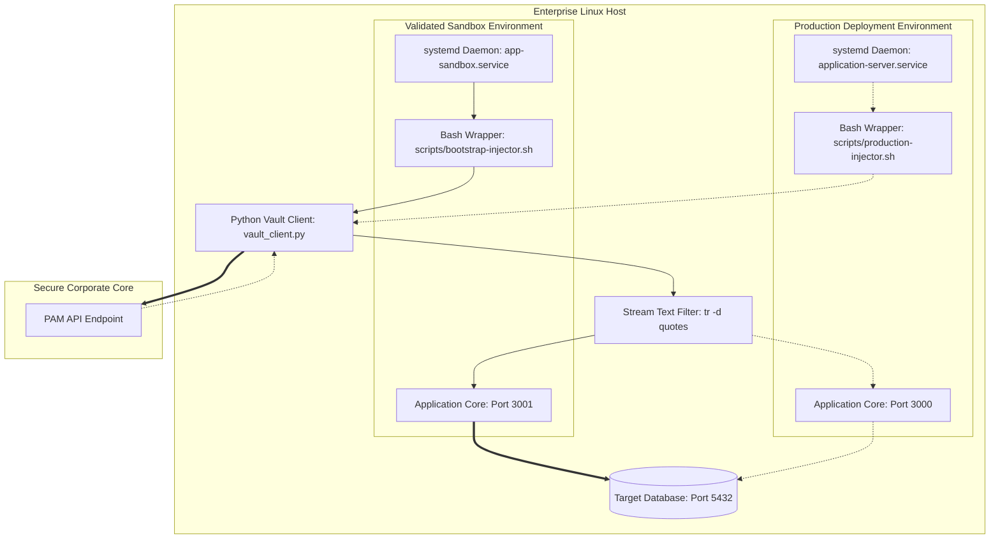

# Enterprise DevSecOps: Dynamic PAM-Driven Credential Rotation for High-Availability Applications

An enterprise-grade DevSecOps integration blueprint implementing dynamic, zero-downtime database credential injection using a Privileged Access Management (PAM) REST API (BeyondTrust Password Safe) and a custom Linux environment wrapper. 

This repository showcases the implementation of a parallel sandbox infrastructure designed to test automated credential rotation pipelines without impacting production systems.

## 🏗️ Architecture Overview

The pipeline eliminates static, hardcoded credentials stored in flat configuration files by dynamically querying the PAM vault during the application initialization phase.

## 🛠️ Key Technical Challenges & Resolutions
1. Dual-Port Instance Forking (Zero-Downtime Sandbox)
Challenge: Test a critical authentication modification on a production application cluster without introducing security risks or service interruptions.

Resolution: Engineered a standalone systemd daemon profile (app-sandbox.service). This created an isolated runtime memory context, distinct tracking PIDs, and split TCP socket streams (forwarding the test cluster to a shadow port 3001), entirely abstracting it away from the production pipeline on port 3000.

2. Stream Sanitization in Shell Injection
Challenge: The application failed to parse standard output returned from the Python API engine because the retrieved secret data string arrived encapsulated in literal JSON string quotation wrappers ("").

Resolution: Implemented an inline translation subshell wrapper manipulation technique using Unix piping filters (| tr -d '"'). This dynamically strips boundaries from the text stream, delivering a raw string payload straight to the initialization environment variables.

3. Enterprise OS-Level Trust Store Optimization
Challenge: Python's cryptographic engines initially rejected connections to internal appliances due to enterprise self-signed certificate authority validations.

Resolution: Bypassed connection blocks safely during initial setup using structural request flags while concurrently reinforcing the underlying operating system trust store. Leveraged administrative tooling (update-ca-trust) to register the organizational Root and Intermediate CA bundles natively inside the host environment to enable full end-to-end verification.

## 💾 System Components & Integration Schematics
The automation components are structured to decouple the orchestration logic from vendor binary upgrades. Scripts are centrally stored in the /scripts/ directory.

1. The Environment Injector Bootstrapper (scripts/bootstrap-injector.sh)
This wrapper script is invoked directly by systemd to intercept the application initialization lifecycle, fetching and injecting runtime configurations directly into memory.

2. Production Deployment Configuration (override.conf)
To migrate this configuration seamlessly to the production instance (port 3000) without modifying vendor-installed base service files, systemd Drop-in Overrides are implemented. This prevents package upgrades from wiping out the automation hooks.

## 📊 Core Competencies Demonstrated
Advanced Automation & Systems Scripting: Mastery of mixing complex Bash scripting paradigms with advanced object extraction architectures in Python.

DevSecOps & Secrets Management: Hands-on experience building custom API integrations with enterprise access management utilities to eliminate hardcoded secrets.

Linux Systems Internals: Practical understanding of how systemd coordinates background daemons, environment variable precedence, process namespace allocation (exec), and system trust anchors.
